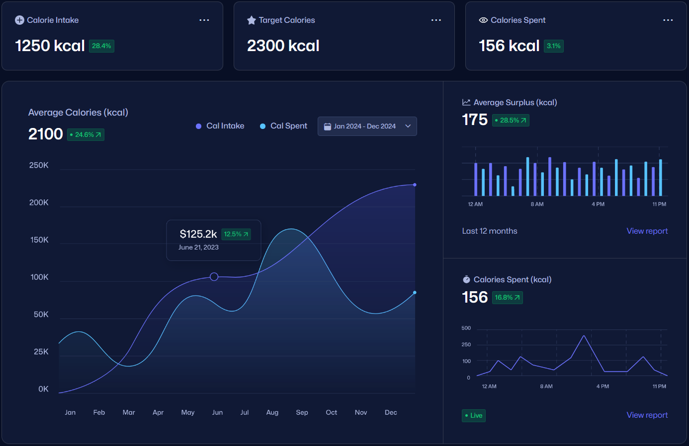

# TrackFit 🏋️

A full-stack health and fitness web application that helps users track nutritional intake, receive personalised dietary recommendations, and manage their fitness journey — all in one place.

> **Final Year Project | Royal Holloway University of London**
> Built with Django, PostgreSQL, Bootstrap, jQuery, and Auth0.

---

## Demo

- [Demo 1](https://www.youtube.com/watch?v=5thw8wlDW2o)
- [Demo 2](https://www.youtube.com/watch?v=s1HUKf79o60)

---

## Table of Contents

- [Overview](#overview)
- [Key Features](#key-features)
- [Architecture](#architecture)
- [Tech Stack](#tech-stack)
- [Supported Systems](#supported-systems)
- [Installation](#installation)
  - [Prerequisites](#prerequisites)
  - [macOS / Linux](#macos--linux)
  - [Windows](#windows)
- [Database Setup](#database-setup)
- [User Authentication](#user-authentication)
- [Testing](#testing)
- [Coming Soon](#coming-soon)

---

## Overview

TrackFit addresses the fragmented state of modern health apps — where users are forced to juggle multiple platforms for nutrition, activity, and goal tracking. It brings these tools into a single, intuitive, and personalised web application designed for consistent, long-term use.

The application was built as a solo final-year university project, applying Agile methodology, Test-Driven Development (TDD), N-tier architecture, and the DRY principle throughout the development lifecycle.



---

## Key Features

### Nutrition Recommendation
TrackFit analyses user profile data (age, gender, height, weight, activity level) and applies the **Harris-Benedict BMR formula** to calculate:
- Basal Metabolic Rate (BMR)
- Daily maintenance calories
- Adjusted calorie targets based on goal category (Weight Loss, Muscle Building, Maintenance, Custom) and intensity level (Mild / Average / Extreme)

For custom goals, users can specify a target weight and goal date — the system calculates a precise daily calorie adjustment based on the required rate of change.

### Nutrition Tracking
- Log daily food intake by selecting from a built-in food database or creating custom entries
- Create reusable meals composed of multiple food items at custom serving sizes
- View a full macronutrient breakdown of daily intake (protein, carbohydrates, fats, sugar, fibre, sodium)
- Sortable, scrollable food and meal tables with a sticky Calories column
- Modal-based logging interface to keep the UI clean and uncluttered

### User Authentication
- Email/password registration and login
- Single Sign-On (SSO) via Google and Facebook (OAuth / Auth0)
- Real-time form validation with password strength meter
- Password recovery via registered email
- Session management and route protection throughout all account pages

### User-Centric Interface
- Fully responsive across desktop, tablet (< 1024px), and mobile (< 768px)
- Dark theme with contrasting accent colours for functional elements
- Animated transitions, collapsible menus, and modal interactions
- Nielsen's Usability Heuristics applied throughout: learnability, simplicity, grouping, error prevention, and visibility of system status

---

## Architecture

TrackFit follows an **N-tier architecture** separating concerns across four layers:

```
┌──────────────────────────────────────────────┐
│           Client Tier (Presentation)          │
│     HTML · CSS · Bootstrap 5 · jQuery        │
│   Responsive UI · Forms · Modals · Tables    │
└─────────────────────┬────────────────────────┘
                      │ HTTP Requests
┌─────────────────────▼────────────────────────┐
│        Application Tier (Business Logic)      │
│               Django (Python)                 │
│   Controllers · Services · Models · Views    │
└─────────────────────┬────────────────────────┘
                      │ ORM Queries
┌─────────────────────▼────────────────────────┐
│        Application Tier (Data Access)         │
│               Django ORM                      │
│        CRUD Abstraction · Validation         │
└─────────────────────┬────────────────────────┘
                      │ SQL
┌─────────────────────▼────────────────────────┐
│              Data Tier (Database)             │
│                 PostgreSQL                    │
│    Users · Profiles · Goals · Foods · Meals  │
└──────────────────────────────────────────────┘
```

### Key Database Models

```python
UserProfile          # OneToOne with Django User; stores age, gender, height, weight, activity_level
BodyGoal             # OneToOne with UserProfile; category, level, target_weight, goal_date
Food                 # Nutritional data per 100g: calories, protein, carbs, fats, sugar, fibre, sodium
Meal                 # ManyToMany with Food via MealItem; user-specific reusable meals
MealItem             # Intermediary: Meal ↔ Food with quantity
DailyIntake          # ManyToMany with Meal via IntakeMeal; one record per user per day
```

---

## Tech Stack

| Layer | Technology |
|---|---|
| Backend | Python 3, Django |
| Frontend | HTML5, CSS3, Bootstrap 5, jQuery, Django Templates |
| Database | PostgreSQL |
| Authentication | Auth0 (OAuth 2.0) |
| Testing | Python `unittest`, BrowserStack |
| Version Control | Git (GitLab) |

---

## Supported Systems

| OS | Status |
|---|---|
| Ubuntu 20.04 / 22.04 LTS | ✅ Supported |
| macOS 12+ | ✅ Supported |
| Windows 10 / 11 | ✅ Supported |

**Runtime requirements:**

| Dependency | Version |
|---|---|
| Python | 3.9+ |
| PostgreSQL | 14+ |
| pip | Latest |

---

## Installation

### Prerequisites

Ensure all of the following are installed before proceeding:

- [Python 3.9+](https://www.python.org/downloads/)
- [PostgreSQL 14+](https://www.postgresql.org/download/)
- [Git](https://git-scm.com/)
- pip (bundled with Python)

Verify your installations:

```bash
python --version
psql --version
git --version
```

---

### macOS / Linux

```bash
# 1. Clone the repository
git clone https://github.com/yourusername/trackfit.git
cd trackfit

# 2. Create and activate a virtual environment
python3 -m venv venv
source venv/bin/activate

# 3. Install dependencies
pip install -r requirements.txt

# 4. Apply database migrations
python manage.py migrate

# 5. (Optional) Seed the food database
python manage.py loaddata foods.json

# 6. Start the development server
python manage.py runserver
```

---

### Windows

```powershell
# 1. Clone the repository
git clone https://github.com/yourusername/trackfit.git
cd trackfit

# 2. Create and activate a virtual environment
python -m venv venv
venv\Scripts\Activate.ps1

# 3. Install dependencies
pip install -r requirements.txt

# 4. Apply database migrations
python manage.py migrate

# 5. (Optional) Seed the food database
python manage.py loaddata foods.json

# 6. Start the development server
python manage.py runserver
```

Then open your browser and navigate to:

```
http://localhost:8000
```

---

## Database Setup

### 1. Create the database

Log into PostgreSQL:

```bash
# macOS / Linux
psql -U postgres

# Windows (run as Administrator)
psql -U postgres
```

Run the following SQL:

```sql
CREATE DATABASE trackfit_db;
CREATE USER trackfit_user WITH PASSWORD 'your_password';
GRANT ALL PRIVILEGES ON DATABASE trackfit_db TO trackfit_user;
\q
```

### 2. Configure environment variables

Create a `.env` file in the project root:

```env
SECRET_KEY=your_django_secret_key
DEBUG=True

DB_NAME=trackfit_db
DB_USER=trackfit_user
DB_PASSWORD=your_password
DB_HOST=localhost
DB_PORT=5432

AUTH0_CLIENT_ID=your_auth0_client_id
AUTH0_CLIENT_SECRET=your_auth0_client_secret
AUTH0_DOMAIN=your_auth0_domain
```

Django reads these in `settings.py`:

```python
DATABASES = {
    'default': {
        'ENGINE': 'django.db.backends.postgresql',
        'NAME': os.getenv('DB_NAME'),
        'USER': os.getenv('DB_USER'),
        'PASSWORD': os.getenv('DB_PASSWORD'),
        'HOST': os.getenv('DB_HOST', 'localhost'),
        'PORT': os.getenv('DB_PORT', '5432'),
    }
}
```

### 3. Run migrations

```bash
python manage.py makemigrations
python manage.py migrate
```

---

## User Authentication

TrackFit uses **Auth0** (OAuth 2.0) for authentication, handling all login, registration, and session management externally — no passwords are stored in the application database.

### Features
- Email and password registration / login
- One-click SSO via **Google** and **Facebook**
- Real-time validation with password strength meter (min. 8 characters, upper/lowercase, numbers, symbols)
- Password recovery via registered email
- Session confidentiality maintained across all Django templates via Auth0 session tokens

### Auth0 Setup

1. Create a free account at [auth0.com](https://auth0.com)
2. Create a new **Regular Web Application**
3. Set the following in your Auth0 dashboard:
    - **Allowed Callback URLs:** `http://localhost:8000/callback`
    - **Allowed Logout URLs:** `http://localhost:8000`
    - **Allowed Web Origins:** `http://localhost:8000`
4. Copy your **Domain**, **Client ID**, and **Client Secret** into the `.env` file as shown above

> Auth0's free tier supports up to 7,500 active users per month — more than sufficient for development and early deployment.

---

## Testing

TrackFit was developed using **Test-Driven Development (TDD)** — tests were written before implementation, following the Red → Green → Refactor cycle.

### Running Tests

```bash
python manage.py test
```

### Unit Tests

Backend logic is covered by Python's `unittest` framework. Key test classes include:

```python
class UserProfileTests(TestCase):
    def test_bmi_calculation(self):
        # Validates BMI = weight / (height_in_metres ** 2)

    def test_body_fat_percentage_male(self):
        # Validates BFP formula for male profiles

    def test_body_fat_percentage_female(self):
        # Validates BFP formula for female profiles

class NutriGuideTests(TestCase):
    def test_bmr_calculator_male(self):
        # Harris-Benedict BMR for male profile

    def test_maintenance_calories_sedentary(self):
        # BMR × 1.2 activity multiplier

    def test_maintenance_calories_active(self):
        # BMR × 1.725 activity multiplier

class BodyGoalTests(TestCase):
    def test_custom_goal_display_all_targets(self):
        # Validates display string for full custom goal

    def test_custom_goal_display_partial_targets(self):
        # Validates display string for partial custom goal
```

### Testing Strategy Summary

| Type | Tool | Purpose |
|---|---|---|
| Unit Testing | Python `unittest` | Backend logic, BMR/calorie calculations, model methods |
| Integration Testing | Django test client | Auth flow, form POST handling, ORM interactions |
| Visual Regression | BrowserStack | UI consistency across screen sizes pre/post-change |
| Cross-Browser | BrowserStack | Chrome, Firefox, Safari, Edge compatibility |
| Acceptance Testing | Manual + BrowserStack | End-to-end user story validation |

---

## Coming Soon

The modular architecture of TrackFit is designed to make the following features straightforward to add:

**Macro Calculator** — Detailed macronutrient targets (protein, carbs, fats) calculated from body composition and workout intensity, integrated with the existing nutrition recommendation engine.

**Activity Tracking** — Log runs, swims, cycles, and gym sessions with duration, distance, and intensity. Automatic calorie expenditure calculations per activity type.

**Personalised Workout Plans** — Create, customise, and follow workout routines with sets, reps, and rest intervals. Interactive in-session mode to tick off exercises in real time.

**Milestones & Notifications** — Progress milestones, daily calorie reminders, and weekly summaries via email or in-app notifications. Visualised progress via charts and graphs.

---

## License

MIT License — free to use, modify, and distribute with attribution.
